+++
title = "Text Classification with Hierarchical Attention Network"
date = '2019-02-08'
tags = [ "Deep Learning", "Neural Networks", "Class18/19", "Hierarchical Network", "NLP", "Classification", "Attention"]
categories = ["course projects"]
banner = "img/seminar/han/banner.jpg"
author = "Seminar Information Systems (WS18/19)"
disqusShortname = "https-humbodt-wi-github-io-blog"
description = "Hierarchical Attention Network - An Introduction"
+++

# Text Classification with Hierarchical Attention Network
## How to assign documents to classes or topics

#### Authors: Hee-Eun Lee, Maria Kränkel - Seminar Information System 18/19

# Introduction

**Imagine you work for a company** that sells cameras and you would like to find out what customers think about the latest release. Ratings might not be enough since users tend to rate products differently. One might consider a product they rates with 3 out of 5 stars very good, others always give full stars even if they dislike a few aspects. Text classification can give a clue, whether ratings actually describe the overall opinion towards the product. Additionally, the number of possibilities to get opinions from is rising: Nowadays, you will be able to find a vast amount of reviews on your product or general opinion sharing from users on various platforms, such as facebook, twitter, instagram, or blogposts. As you can see, the number of platforms that need to be operated is quite big and therefore also the amount of comments or reviews. So, how can you deal with all of this textual data and gain knowledge from it?

## Outline
* [Introduction](#introduction)
* [Text Classification](#text-classification)
* [Literature Review](#literature-review)
* [Text Classification with Hierarchical Attention Network](#text-classification-with-hierarchical-attention-network)
  * [Architecture of Hierarchical Attention Network](#architecture-of-hierarchical-attention-network)
  * [Word Level](#word-level)
  * [Sentence Level](#sentence-level)
  * [Implementation](#implementation)
* [Applications](#applications)
* [News Classification](#news-classification)
* [Take Away](#take-away)

# Text Classification

**Evaluating all of the textual data manually** is very time consuming and strenuous. A more efficient way to extract important information from it is text classification.  
Text classification is a fundamental task in natural language processing. The goal is to assign unstructured documents (e.g. reviews, emails, posts, website contents etc.) to classes, that is, to classify them. Such classes can be review scores like star ratings, spam or topic labeling.  
Essentially, text classification can be used whenever there are certain tags to map to a large amount of textual data. To learn the how to classify, we need to build classifiers which are obtained from labeled examples. In this way, the process of examining information becomes automated and thus simpler.

# Literature Review
## How do different methods perform in text classification problems?
**For our implementation of text classification**, we have applied a hierarchical attention network, a classification method from Yang and others from 2016. The reason they developed it, although there are already well working neural networks for text classification, is because they wanted to pay attention to certain characteristics of document structures which have not been considered previously.  
But before going deeper into this, let's have a look at what others did:

The basics of all text classification problems lie in so-called Information Retrieval (IR) methods which started to be developed in the early 1970s. These first methods were unsupervised, that is, they try to find information from a given text document without classifying it or assigning labels to it in any kind.  
Here you can see the most important steps in unsupervised text classification:

**Unsupervised**

Year | Authors | Method Characteristics | Paper
-----|---------|------------------------|-----------------------------
1971 | Jardine, van Rijsbergen | Clustering keywords of similar texts | [The Use of Hierarchic Clustering in Information Retrieval](https://www.researchgate.net/publication/220229653_The_Use_of_Hierarchic_Clustering_in_Information_Retrieval)
1974 | Salton et al. | Ranking words in accordance with how well they are able to discriminate the documents | [A Theory of Term Importance in Automatic Text Analysis.](https://eric.ed.gov/?id=ED096987)
1983 | Salton, McGill | SMART - First text representations with vectors | [Introduction to Modern Information Retrieval](http://www.information-retrieval.de/irb/ir.part_1.chapter_3.section_6.topic_6.html)
1992 | Cutting et al. | SG - Scattering text to few clusters, manual gathering to sub-collections | [Scatter/Gather: A Cluster-based Approach to Browsing Large Document Collections](https://www-users.cs.umn.edu/~hanxx023/dmclass/scatter.pdf)
1998 | Zamir, Etzioni | Suffix Tree - Phrases shared between documents - First IR for web search engines | [Web Document Clustering: A Feasibility Demonstration](https://homes.cs.washington.edu/~etzioni/papers/sigir98.pdf)

Find all listed abbreviations in the following table:

Abbr. | Explanation
------|--------------------------------------------------------
SMART | System for the Mechanical Analysis and Retrieval of Text
SG | Scatter/Gather

With the improvement of the user-friendliness and related spread of internet usage, automated classification of growing numbers of data became important. Several supervised respectively semi-supervised (where the class information are learned from labeled data) are shown in the next table.  
Since we use a neural network, the comparison with other neural networks is prior for us. Of course, there are several different implementations of convolutional and recurrent neural networks, below are only mentioned the most 'innovative'.

**(Semi-) Supervised**

Year | Network | Authors | Method Characteristics | Paper
-----|---------|---------|------------------------|--------------------------
1995 | PN | Makoto, Tokunaga | Clustering by maximum Bayesian posterior probability | [Hierarchical Bayesian Clustering for Automatic Text Classification](http://citeseerx.ist.psu.edu/viewdoc/download;jsessionid=BE17EC88A0C9DB576DA0E36C70F54EC3?doi=10.1.1.52.2417&rep=rep1&type=pdf)
1999 | PN | Nigam et al. | Improving learned classifiers with Expectation Maximization and Naive Bayes | [Text Classification from Labeled and Unlabeled Documents using EM.](http://www.kamalnigam.com/papers/emcat-mlj99.pdf)
 | | | |
1998 | SVM | Joachims | Binary classifying, represenation with support-vectors | [Text Categorization with Support Vector Machines: Learning with Many Relevant Features.](http://web.cs.iastate.edu/~jtian/cs573/Papers/Joachims-ECML-98.pdf)
2004 | SVM | Mullen, Collier | Classifying with SVM and unigrams | [Sentiment analysis using support vector machines with diverse information sources](http://www.aclweb.org/anthology/W04-3253)
2005 | SVM-H | Matsumoto et al. | SVM + Unigrams and Bigrams, Sentence dependancy sub-trees, word sub-sequences | [Sentiment Classification Using Word Sub-sequences and Dependancy Sub-trees](https://link.springer.com/content/pdf/10.1007%2F11430919_37.pdf)
 | | | |
1994 | NN | Farkas | NN + Thesaurus -> First weighted, dictionairy-based relations | [Generating Document Clusters Using Thesauri and Neural Networks](https://vdocuments.site/ieee-proceedings-of-canadian-conference-on-electrical-and-computer-engineering-58e24c154d826.html)
1996 | NN-SOM | Hyötyniemi | Competitive learning instead of error-correction (e.g. backpropagation), Mapping to reduced dimensions | [Text Document Classification with Self-Organizing Maps](http://lipas.uwasa.fi/stes/step96/step96/hyotyniemi3/)
1998 | NN-SOM-H | Merkl | SOM on hierarchical document levels | [Text classification with self-organizing maps: Some lessons learned](https://www.sciencedirect.com/science/article/pii/S0925231298000320)
 | | | |
2014 | CNN | Johnson, Zhang | CNN on word order instead of low-dimensional word vectors | [Effective Use of Word Order for Text Categorization with Convolutional Neural Networks](https://arxiv.org/pdf/1412.1058.pdf)
2014 | CNN | Kim | Simple CNN with static vectors on top of pre-trained word vectors | [Convolutional Neural Networks for Sentence Classification](https://arxiv.org/pdf/1408.5882.pdf)
2014 | CNN-char | dos Santos, Zadrozny | Semantic word informations with CNN on character level | [Learning Character-level Representations for Part-of-Speech Tagging](http://proceedings.mlr.press/v32/santos14.pdf)
2015 | LSTM | Tai et al. | LSTM on tree-structured networks | [Improved Semantic Representations From Tree-Structured Long Short-Term Memory Networks](http://aclweb.org/anthology/P15-1150)
2015 | C-LSTM | Zhou et al. | CNN for higher-level representations, LSTM for sentence representations | [A C-LSTM Neural Network for Text Classification](https://arxiv.org/pdf/1511.08630.pdf)
2015 | CNN/LSTM-GRU | Tang et al. | CNN / LSTM for sentence representation, GRU for semantic information | [Document Modeling with Gated Recurrent Neural Network for Sentiment Classification](http://ir.hit.edu.cn/~dytang/paper/emnlp2015/emnlp2015.pdf)
2016 | HAN | Yang et al. | NN and GRU on hierarchical document levels with attention on contexts | [Hierarchical Attention Networks for Document Classification](https://www.cs.cmu.edu/~diyiy/docs/naacl16.pdf)

Abbr. | Explanation
------|-------------------
PN | Probabilistic Network
SVM | Support-vector Machine
H | Hierarchical Document Structure
NN | Neural Network
SOM | Self-organizing Map
CNN | Convolutional Neural Network
LSTM | Long Short-term Memory
GRU | Gated Recurrent Unit
HAN | Hierarchical Attention Network

# Text Classification with Hierarchical Attention Network

Contrary to the most text classification implementations, HAN also considers the hierarchical structure of documents (document - sentences - words) and includes an attention mechanism that's able to find the most important words and sentences given the whole contexts, whereas other methods only return importance weights resulting from previous words.  
Summarizing, HAN tries to find a solution to these problems, previous works did not consider:
* Not every word in a sentence and every sentence in a document is equally important to extract the main information from the document.
* To extract the main information in changing contexts, it is not enough to work with the single information of each word, but to get the context of all sentences and word interactions.

In this way, HAN performs better in predicting the class of a given document.  
To start from scratch, have a look at this example:

 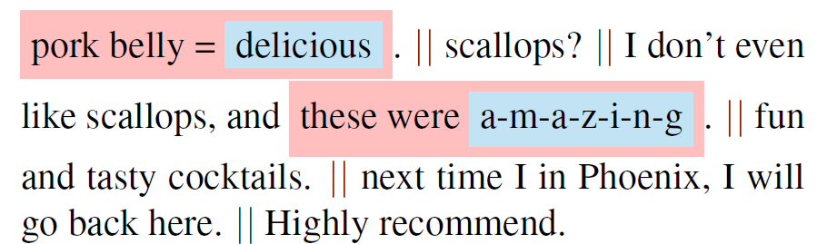
 [1](#references)

 
Here we have a review from yelp that consists of five sentences. The highlighted sentences in red deliver stronger meaning compared to the others and inside, the words *delicious* and *amazing* contribute the most in attributing the positive attitude contained in this review. HAN predicts pretty well the most relevant information as it assorts with what we would intuitively gain from this review.  

## Architecture of Hierarchical Attention Network

**This is how the architecture** of HAN looks like:

 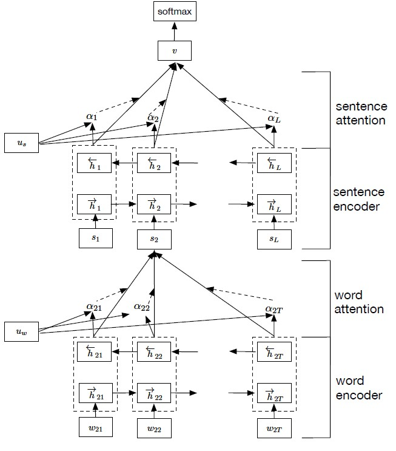
 
[1](#references)

First, the network considers the hierarchical structure of documents by constructing a document representation by building representations of sentences and then aggregating those into a document representation.  
**Sentence representations** are built by encoding the word of a sentence firstly and apply the attention mechanism on them secondly resulting in a *sentence vector*.  
**Document representation** is built in the same way, only having the sentence vector of each sentence of the document as input.  

Now, have a different view on the architecture of the model to understand how it works.  
The same algorithms are applied two times: First on word level and afterwards on sentence level.  
The model consists of
* the encoder, which returns relevant contexts, and
* the attention mechanism, which computes importance weights of these contexts as one vector.

### Word Level

* As input we have structured tokens **w_it**, that is word i per sentence t. We do not keep all words in a sentence. Learn more about that in section [data preprocessing](data-preprocessing).
* Since the model is not able to process plain text of data type *string*, the tokens run through an Embedding layer which 'assigns' multidimensional vectors **W_e*w_ij** to each token. In this way, words are represented numerically as **x_it** as a projection of the word in a continuous vector space.  
	There are several embedding algorithms; the most popular are [word2vec](https://code.google.com/archive/p/word2vec/) and [GloVe](https://nlp.stanford.edu/projects/glove/). It is also possible to use pre-trained word embedding, so you can accelerate your model training.  
  

  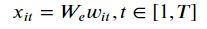
  

#### Word Encoder

* These vectorized tokens are the inputs for the next layer. Yang et al. use a Gated Recurrent Network (GRU) as encoding mechanism. As a short reminder: In a RNN, states are 'remembered' to ensure we can predict words depending on previous words. GRU has a so-called 'hidden state' which can be understood as a memory cell to transfer information. Two gates decide about whether to keep or forget information and with this knowledge, to update the information that should be kept. If you are interested in learning more about GRU, have a look at this nice [blog post](https://isaacchanghau.github.io/post/lstm-gru-formula/).  
	The purpose of this layer is to extract relevant contexts of every sentence. We call these contexts *annotations* per word.  
	Note that in this model, *bidirectional* GRU is applied to get annotations of words by summarizing information from both directions resulting in a summarized variable **h_it**.   
  

  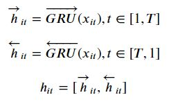
  

#### Word Attention

* Those annotations h_it build the base for the attention mechanism which starts with another hidden layer, a one-layer Multilayer Perceptron. Goal is to let the model learn through training with randomly initialized weights and biases. Those 'improved' annotations are then represented by **u_it**. Furthermore, this layer ensures that the network does not falter with a tanh function. This function 'corrects' input values to being between -1 and 1 and also maps zeros to near-zeros.  
  

  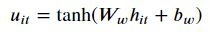
  

* Our new annotations are again multiplied with an outside trainable context vector **u_w** and normalized to an importance weight per word **alpha_it** by softmax function.  
  

  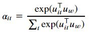
  

* The sum of these importance weights concatenated with the previously calculated context annotations is called sentence vector **s_i**  
  

  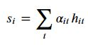
  

### Sentence Level

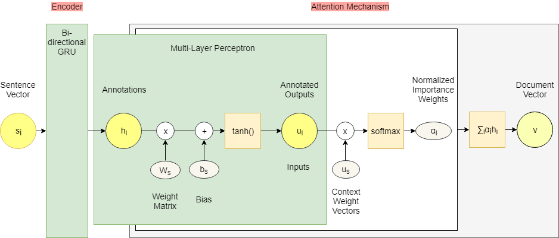

* Then the whole network is run on sentence level with basically the same procedure as on word level. Of course, there is no embedding layer as we already get sentence vectors **s_i** from word level as input. In addition, now we focus on the actual sentence i.
* Trainable weights and biases are again outside randomly initialized.
* The final output is a document vector **v** which can be used as features for document classification.
* Find all formula for sentence level below.

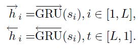
 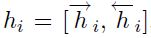
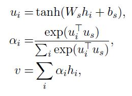

## Implementation

### Import libraries

As the package [Keras](https://keras.io/) is 'a high-level neural networks API' extremely useful for deep learning problems, we recommend to install it in an own python environment.

libraries

### Data Preprocessing

To demonstrate how to apply HAN we use a part of Amazon reviews for Electronic data which are public available [here](http://jmcauley.ucsd.edu/data/amazon/). This data set consists of nearly 1.7 billion reviews. As the model learns through training it is highly important to have data sets with a large number of observations. Nevertheless, a billion reviews would take us **days** to train on, so we set the number of reviews to keep equal to 100,000.  
We combine the review columns to one column to consider them together in the model and keep only the necessary columns.

=============script first_steps

Words have to be lemmatized to ensure that not every single typo or related term is handled by itself. Additionally, so-called stop words are filtered out. In our case, that is mainly prepositions like *as* or *to* that do not contribute to the meaning of the text.

=================scr clean_string

### References

1 Yang et al. Hierarchical Attention Networks for Document Classification. 2016
